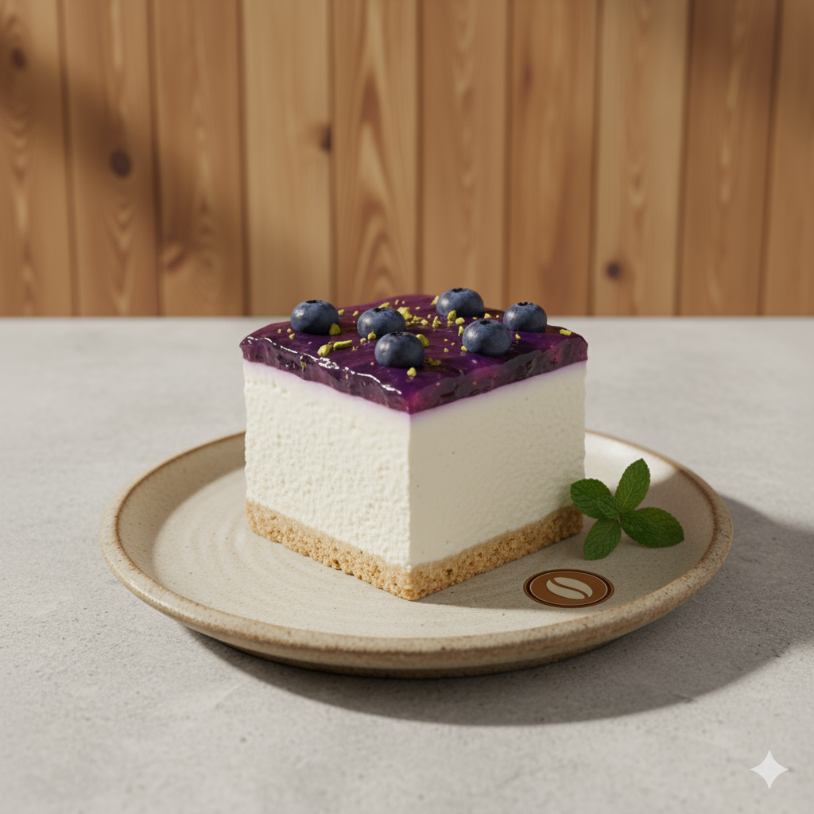

# ☕ Al-Qahwa Specialty Coffee & Healthy Sweets Store

[](https://saraaya6-coffee.netlify.app/)

## Project Overview

**Al-Qahwa** (meaning "The Coffee" in Arabic) is a professional, responsive e-commerce front-end template designed for a modern specialty coffee shop that also offers a selection of healthy sweets.

This project is built using pure HTML, CSS, and JavaScript, focusing on modern web design, an intuitive user experience, and a custom coffee-themed aesthetic. It features a fully functional shopping cart simulation using `localStorage` and dynamic product loading.

## 🌟 Features

* **Responsive Design:** Fully optimized for all screen sizes (mobile, tablet, and desktop) using the Bootstrap 5 framework.
* **Custom Theming:** A unique, dark brown and earthy color palette is implemented via a custom CSS file (`style.css`), creating a warm and professional coffee-shop atmosphere.
* **Dynamic Product Display:** Products are categorized and displayed on the home page using horizontal carousels and on the dedicated `products.html` page using a dynamic grid.
* **Client-Side E-Commerce Logic:**
    * **Shopping Cart:** Persistent cart management using `localStorage` (`app.js`, `products.js`, `static.js`).
    * **Quantity Control:** Users can easily add/remove items and adjust quantities within the cart modal.
    * **Toast Notifications:** Subtle, themed notifications appear upon successfully adding items to the cart.
    * **Checkout Simulation:** A final checkout step generates a detailed receipt/invoice summary.
* **Detailed Product Pages:** Each product links to a dedicated page (`product-detail.html`) that fetches and displays extended information and a product description.
* **Utility Pages:** Includes static pages for **Contact Us**, **Privacy Policy**, and **Terms & Conditions**.
* **Hero Section:** Features a seamless, full-width video background for a premium feel.

## 🛠️ Tech Stack

* **HTML5** (Semantic Structure)
* **CSS3** (Custom Styling & Theming - `style.css`)
* **JavaScript (ES6+)** (Core logic, DOM manipulation, cart functions)
* **Bootstrap 5** (For responsive layout and UI components like Modals and Navbar)
* **Bootstrap Icons**

## 📂 Project Structure
. ├── images/ # All visual assets (products, logo, hero) ├── videos/ # Contains hero video (your-video.mp4) ├── app.js # Main JS for homepage logic, cart, and modals ├── products.js # JS for products grid page logic ├── product-detail.js # JS for individual product page logic ├── static.js # JS for shared cart logic on static pages ├── style.css # Custom CSS styles and theme ├── index.html # Home Page ├── products.html # All Products Grid Page ├── product-detail.html # Individual Product Detail Page ├── contact.html # Contact Us Page ├── policy.html # Privacy Policy Page └── terms.html # Terms & Conditions Page


## 📸 Content Highlights

The store is fully populated with over 20 detailed products across four categories:

| Category | Product Example | Image Reference (Relative Path) |
| :--- | :--- | :--- |
| **Coffee** (قهوة) | Spanish Latte, Cold Brew, V60 | `images/latte.png` |
| **Healthy Sweets** (حلويات صحية) | Vegan Cheesecake, Protein Brownie | `images/Cheesecake.png` |
| **Coffee Cups** (أكواب قهوة) | Art Cup, Desert Cup, Office Cup | `images/art-cup.png` |
| **Coffee Beans** (محاصيل قهوة) | Yemeni Yafa, Ethiopian, Brazilian | `images/Coffee-Beans.png` |

---

### **Hero Image Example**

*Showcasing the warm, professional aesthetic and key offerings.*


### **Product Example: Healthy Sweet**

*A piece of the Vegan Cheesecake.*



---

## 🚀 Installation & Setup

1.  **Clone the repository:**
    ```bash
    git clone [Your Repository URL]
    cd coffee-store
    ```
2.  **Open the file:**
    Simply open the `index.html` file in your web browser. The project does not require a local server to run the front-end features, as all data is stored locally within the JavaScript files.
